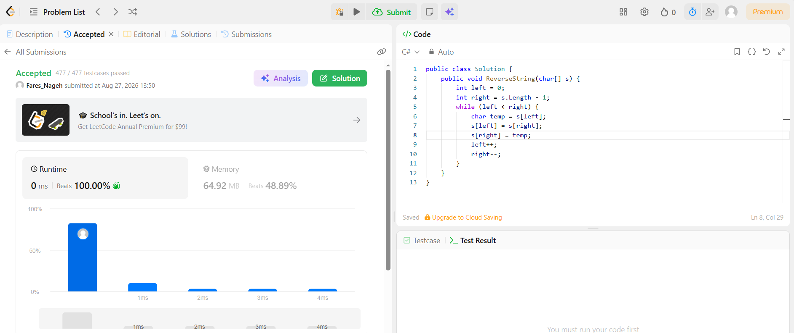

# Simple Calculator Project

## Project Description
A simple console-based calculator application that takes two numbers from the user and performs basic arithmetic operations (Addition, Subtraction, Multiplication, and Division). It handles division by zero and invalid inputs gracefully, and allows the user to perform multiple calculations without restarting.

## Language and Technologies Used
* **Language:** C#
* **Framework:** .NET Console Application
* **Environment:** Visual Studio

## How to Run It
1. Clone the repository to your local machine.
2. Open the `Calculator.sln` file in Visual Studio.
3. Press `Ctrl + F5` or click on the "Start Without Debugging" button to run the application.
4. Follow the on-screen instructions to enter numbers and choose an operation.

## LetCode Link

https://leetcode.com/problems/reverse-string/submissions/2121807186/

letcode

Idea: I swap the first letter with the last one, then move inward and repeat until I reach the middle.

Time Complexity: O(n) - We go through the array only once.

Space Complexity: O(1) - We don't use any extra memory or new arrays

## Application Preview
